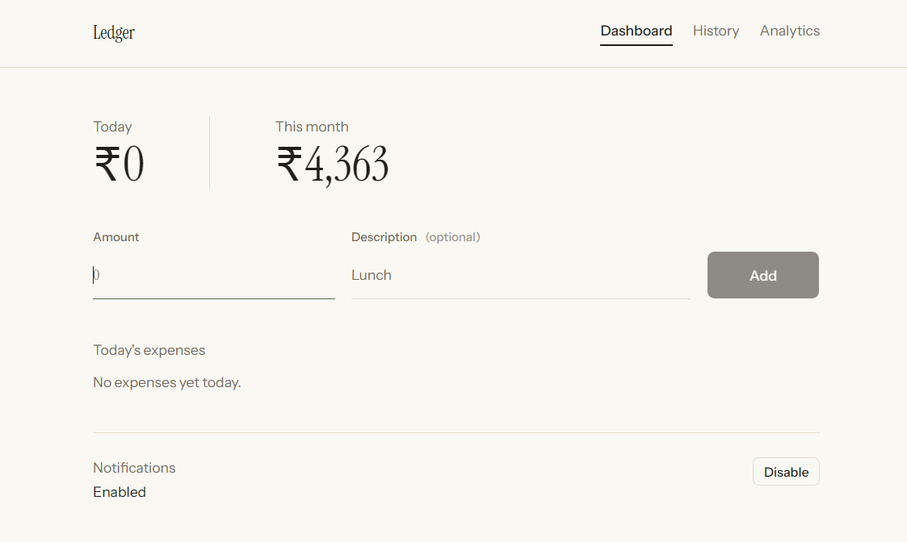
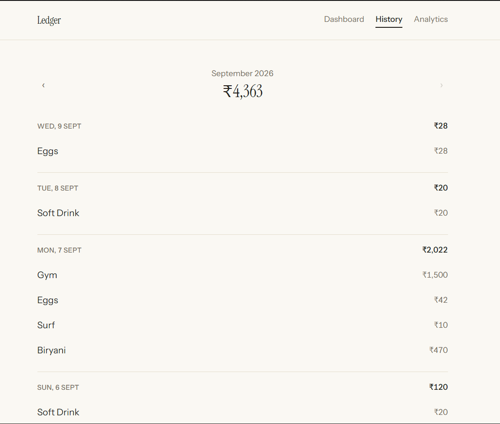
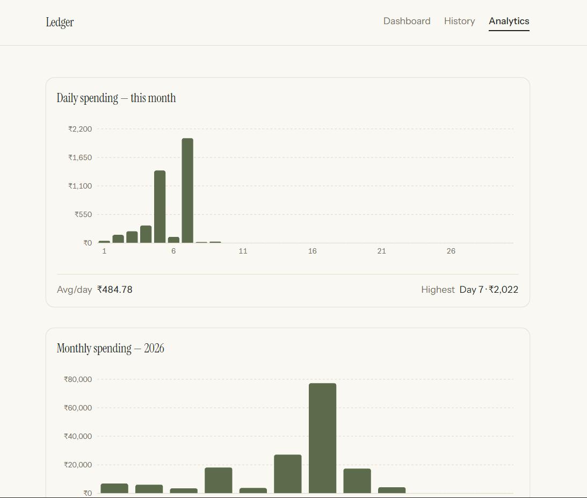

# 🌐Expense Ledger

<div align = "center">


</div>

Expense Ledger is a personal daily expense tracking web application built to replace manually maintaining expenses and totals with a simple digital ledger.

It helps track daily spending, view expense history, analyze spending patterns, and receive reminders to keep the ledger updated.

<br>

<div align = "center">


</div>

<br>

## 💠Tech Stack

▫️<b>FrontEnd : </b>React, TypeScript, Tailwind CSS, Vite<br>
▫️<b>UI : </b>shadcn/ui, Base UI<br>
▫️<b>Charts : </b>Recharts<br>
▫️<b>BackEnd : </b>Supabase Edge Functions, Deno<br>
▫️<b>Database : </b>PostgreSQL (Supabase)<br>
▫️<b>APIs : </b>REST APIs, Web Push<br>
▫️<b>Deployment : </b>Vercel, Supabase<br>
▫️<b>Others : </b>PWA, Service Worker, VAPID<br>

<br>

## 💠Features

#### ▫️Expense Tracking
> Add, edit, and delete daily expenses with amount and optional description. Expense dates are handled automatically using IST.

#### ▫️History & Records
> View expenses grouped by day, navigate between months, and view historical monthly spending summaries.

#### ▫️Analytics
> Visualize daily and monthly spending with charts along with average daily spending and highest spending days.

#### ▫️PWA
> Install Expense Ledger as a standalone app on supported devices, including iPhone through Safari's Add to Home Screen.

#### ▫️Notifications
> Receive daily and month-end reminders through Web Push notifications, including support for installed iPhone PWAs.

#### ▫️Authentication
> Access the application through a one-time access code with a persistent secure session.

<br>

## 💠Design

> Expense Ledger follows a simple ledger-inspired design instead of a typical fintech or SaaS dashboard. It uses a warm paper-like background, minimal borders, muted colors, and typography that gives important spending numbers more visual emphasis.

<br>


## 💠Screenshots

### ▫️Dashboard

<p>
  
</p>

### ▫️History

<p>
  
</p>

### ▫️Analytics

<p>
  
</p>

<br>

## 💠Architecture

```text
Frontend
   │
   ▼
Supabase Edge Functions
   │
   ▼
PostgreSQL Database
```

The frontend communicates with the backend through Supabase Edge Functions, while database operations and sensitive server-side logic remain on the backend.

<br>

## 💠Project Structure
```
expense-ledger/
├── assets/
├── public/
├── src/
│   ├── components/
│   ├── lib/
│   ├── pages/
│   ├── types/
│   ├── App.css
│   ├── App.tsx
│   ├── index.css
│   └── main.tsx
├── supabase/
│   ├── functions/
│   └── config.toml
├── componenets.json
├── deno.lock
├── eslint.config.js
├── index.html
├── package-lock.json
├── package.json
├── tsconfig.app.json
├── tsconfig.json
├── tsconfig.node.json
├── vite.config.ts
├── vercel.json
└── README.md
```
<br>

## 💠Run Project Locally

After cloning / forking the repository:

▫️Frontend
```bash
git clone https://github.com/divyanshsood22/expense-ledger.git
cd expense-ledger
npm install
npm run dev
```
▫️Production Build
```bash
npm run build
```
▫️Backend
```bash
supabase secrets set ACCESS_CODE_SALT=
supabase secrets set ACCESS_CODE_HASH=
supabase secrets set SESSION_SECRET=
supabase secrets set ALLOWED_ORIGIN=http://localhost:5173,https://your-production-domain
supabase secrets set VAPID_PUBLIC_KEY=
supabase secrets set VAPID_PRIVATE_KEY=
supabase secrets set VAPID_SUBJECT=mailto:you@example.com
supabase secrets set CRON_SECRET=
```
Then deploy the functions:
```bash
supabase functions deploy verify-access --use-api
supabase functions deploy check-session --use-api
supabase functions deploy expenses --use-api
supabase functions deploy historical-summaries --use-api
supabase functions deploy save-push-subscription --use-api
supabase functions deploy send-notifications --use-api
```
<br>

## 💠Environment Variables

Create a `.env.local` file in the project root:
```
VITE_SUPABASE_URL=
VITE_SUPABASE_ANON_KEY=
VITE_VAPID_PUBLIC_KEY=
```

<br>

---

<p align="center">
  <b>Expense Ledger</b>
  <br>
  <sub>A simple way to keep track of where the money goes.</sub>
  <br><br>
  Built with ❤️ by <b>Divyansh Sood</b>
</p>
